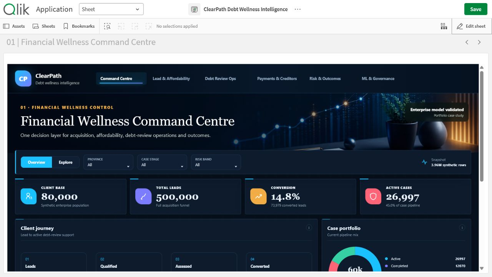

# ClearPath Debt Wellness Intelligence — Qlik Sense

A dark, enterprise-grade Qlik Sense portfolio app built from the DebtBusters Intelligence Platform repository. ClearPath is a fictional display identity created for employer-facing presentation.

## Decision coverage

- Financial Wellness Command Centre
- Lead & Affordability Funnel
- Debt Review Operations
- Payment & Creditor Performance
- Credit Risk & Outcomes
- ML & Governance

The report brings together a 500,000-lead funnel, 80,000 clients, 60,000 debt-review cases, payment performance, credit monitoring and five validated ML use cases across approximately 3.96 million synthetic rows.

## Open locally

1. Copy `extension/clearpath-debt-intelligence` into `Documents/Qlik/Sense/Extensions/`.
2. Copy `ClearPath Debt Wellness Intelligence.qvf` into `Documents/Qlik/Sense/Apps/`.
3. Open Qlik Sense Desktop and launch the app from the hub.

The extension ZIP contains the same installable extension package. Data and visuals are self-contained for portfolio viewing; no external database connection is required.

## Portfolio note

All client and operational data is synthetic. The app demonstrates responsible decision support and does not provide financial advice or automated eligibility decisions.
